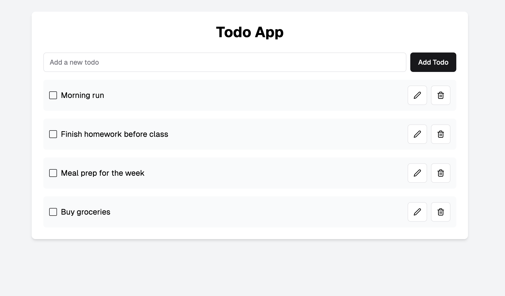
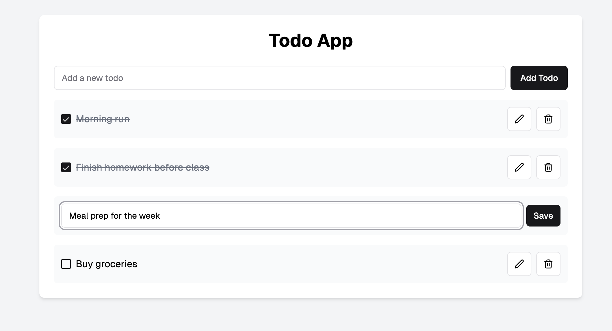

# Todo App with Prisma and PostgreSQL

To get started, install dependencies:
```
npm install
```

Then, run the development server:
```
npm run dev
```

Open the following link to verify the server is running:
> http://localhost:8000/api/v1/projects

---

## Assignment Objective:
- Create an API server connected to a PostgreSQL database using **Prisma** as the ORM.
- Implement full CRUD functionality for managing a to-do list:
  - **Create**: Add a new to-do item.
  - **Read**: View all to-do items.
  - **Update**: Edit an existing to-do item (e.g., mark as done or update details).
  - **Delete**: Remove a to-do item.
- Design the database schema using Prisma's `schema.prisma` file.

---

## Getting Started with Prisma and PostgreSQL:

0. **You may use this template to get started:**
   - Or you can re-use your code from the previous assignment and change the backend to fulfill the requirements in this assignment.

1. **Set up your PostgreSQL database:**
   - Ensure you have PostgreSQL installed and running.
   - Create a new database for this assignment.

   Example command to create a database:
   ```
   CREATE DATABASE todo_app;
   ```

2. **Configure Prisma:**
   - Initialize Prisma in your project:
     ```
     npx prisma init
     ```
   - Update the `DATABASE_URL` in the `.env` file to match your PostgreSQL configuration.

   Example `.env` file:
   ```
   DATABASE_URL="postgresql://<username>:<password>@localhost:5432/todo_app"
   ```

3. **Design your Prisma schema:**
   - Edit the `prisma/schema.prisma` file to define your database tables and relationships.
   - Example schema for a to-do list:
     ```prisma
     datasource db {
       provider = "postgresql"
       url      = env("DATABASE_URL")
     }

     generator client {
       provider = "prisma-client-js"
     }

     model Todo {
       id        Int      @id @default(autoincrement())
       title     String
       isDone    Boolean  @default(false)
       createdAt DateTime @default(now())
     }
     ```

4. **Run the Prisma migrations:**
   - Generate your database schema:
     ```
     npx prisma migrate dev --name init
     ```
   - Generate the Prisma client:
     ```
     npx prisma generate
     ```

5. **Integrate Prisma into your Node.js application:**
   - Import and use Prisma in your application:
     ```javascript
     const { PrismaClient } = require('@prisma/client');
     const prisma = new PrismaClient();
     ```

---

## Assignment Requirements:
- Implement the following API endpoints:
  - `GET /todos` - Fetch all to-do items.
  - `POST /todos` - Add a new to-do item.
  - `PUT /todos/:id` - Update an existing to-do item.
  - `DELETE /todos/:id` - Delete a to-do item.
- You may use the same frontend as the previous assignment - [TODO app with Nodejs x PSQL](https://classroom.github.com/a/HP6Bf6jI )
  - but the backend for this assignment should use **Prisma**
---

## Example UI:
Below is an example UI for this assignment. Use this as a reference.

### To-Do List Overview:


### Edit or Mark Tasks as Done:


---

## Notes:
- Focus on integrating **Prisma** with **PostgreSQL** and implementing CRUD operations.
- You can test your API endpoints using Postman before working on the front-end.
- Ensure your database schema is well-structured and normalized.
- Follow best practices for clean and maintainable code.

---

Good luck, and feel free to reach out if you have any questions!
